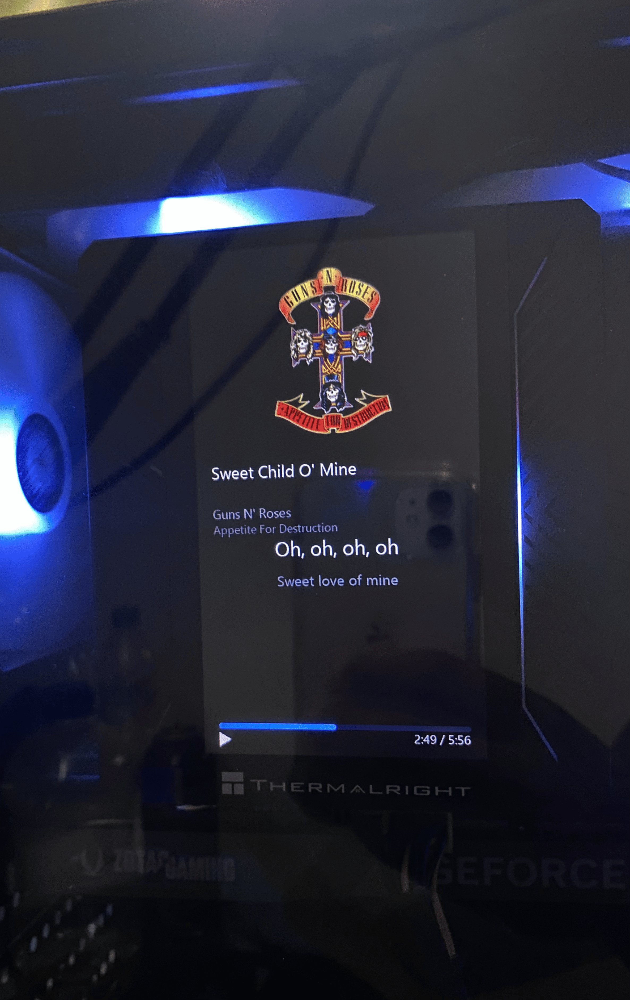
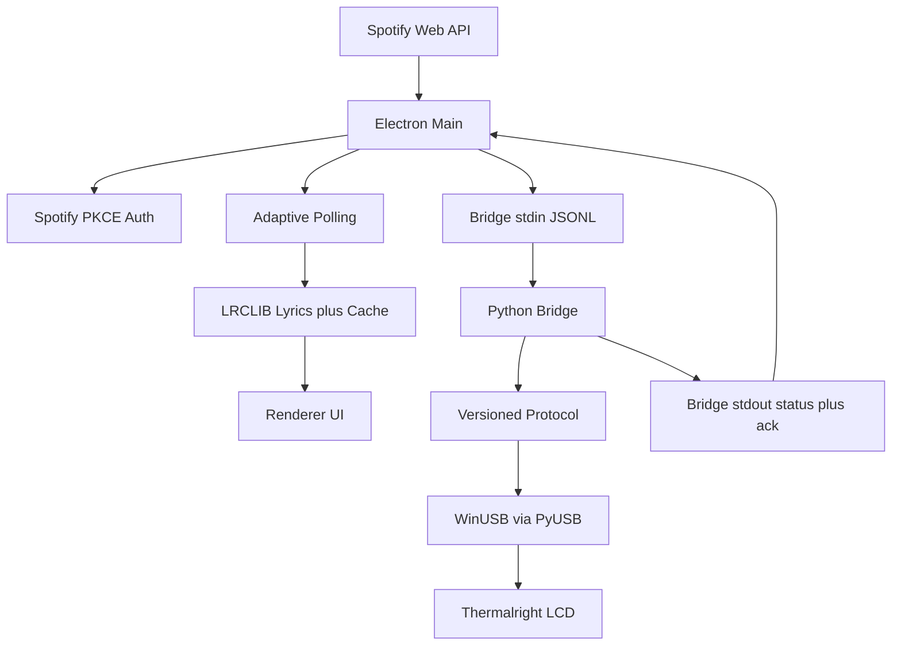

# LyricVision LCD

**Spotify-synced lyrics on your Thermalright LCD.**

LyricVision LCD shows live Spotify playback — cover art, progress,
and synced lyrics — on a Thermalright USB LCD panel mounted in
your PC. It is built for the Peerless Assassin 120 Vision MAX and
runs on Windows 10/11 x64.

What it does: sign in with Spotify, press play, and the panel
follows the music line by line. The app polls playback state,
fetches synced lyrics, and streams rendered frames to the display
over USB.

[](LICENSE)
[](https://github.com/)
[](ROADMAP.md)
[](https://github.com/OJPalenzuela/lyricvision-lcd/actions/workflows/smoke.yml)

## Demo

Real glass photo — unified layout (cover + synced lyrics) on the Vision MAX:



> Short demo clip (`hero.gif`) pending — no recording yet.

## Download

Get the latest Windows installer from
[Releases](https://github.com/OJPalenzuela/lyricvision-lcd/releases/latest),
then follow the [Install guide](docs/install.md).
New to Spotify sign-in? Start with
[Spotify setup](docs/spotify-setup.md), then the
[First-run guide](docs/first-run.md).
Stuck? See [Troubleshooting](docs/troubleshooting.md) and the
[FAQ](docs/faq.md). Direction: [Roadmap](ROADMAP.md).

> v0.1 is unsigned, so Windows SmartScreen will warn about an
> unknown publisher. Signing is a public blocker tracked in the
> [Release checklist](docs/release-checklist.md) — local
> development and packaging are not affected.

## Quick path

1. Download the installer from Releases and run it (v0.1 is unsigned — SmartScreen will warn).
2. Connect the panel, quit TRCC/SignalRGB, start the app, connect Spotify.
3. Press play — lyrics appear on the glass within seconds.

Developers: `pnpm install`, then `pnpm start` (needs Windows + panel + Spotify client ID).
Verify: `python tests/test_registry.py` and `python tests/test_protocol.py` (both should exit 0).

## Features

- Synced lyrics on the glass, line by line with the music
- Unified on-glass layout: cover art, progress bar, current and next line
- Spotify sign-in with PKCE (no client secret needed)
- Adaptive playback polling (2–4 s while playing, 15 s when idle)
- Synced lyrics via LRCLIB (no scraper, no private API)
- Lyrics cache on disk (LRU plus 30-day TTL) for fast repeat plays
- Manual sync offset (−2000 ms to +2000 ms) when lines feel early or late
- Adjustable stream rate (FPS slider, 5–30, default 10)
- System tray with LCD status and hide-to-tray behavior
- Continuous stream keeps the firmware from blanking the panel
- Explicit unknown-panel state instead of a silent wrong guess
- Start-with-Windows toggle (per-user, no elevation)
- TRCC/SignalRGB detection with a quit-before-claim warning
- Redacted diagnostics export safe to attach to bug reports

## Supported panels (v0.1)

| Panel | Status | USB buffer | Glass | Transform |
|---|---|---|---|---|
| Peerless Assassin 120 Vision MAX (PM 11 / SUB 5) | Tested — primary target | 854×480 landscape | 480×854 portrait | rotate 90° CW in software |
| Vision 360 family (PM 72 / 129, any SUB) | Experimental compatibility, not validated | 480×480 | 480×480 square | none |
| Anything else | Not supported | — | — | explicit `unknown` fallback, never a silent guess |

> Physical validation note: the Vision MAX row was verified live
> against real glass (orientation, JPEG q80 frames, PM/SUB
> handshake). The Vision 360 row has a registry entry for
> compatibility but no physical validation in this project, so it
> is not declared compatible.

## How this project started

The stock Thermalright utility speaks a proprietary USB protocol
with no public documentation. This project reverse-engineered it
live against the real glass and turned it into an open source app:
probing the handshake until the panel answered, confirming its
PM/SUB identity, and iterating on rendered frames until markers
landed upright and full-bleed. Validated on glass: portrait
orientation at 480x854, JPEG q80 encoding, and the PM/SUB
handshake. The result drives the Vision MAX with Spotify lyrics
instead of the closed utility.

## How it works

**Electron shell** — owns everything user-facing: Spotify PKCE
auth, adaptive playback polling, LRCLIB lyrics fetch with LRU/TTL
cache, portrait frame composition, system tray with LCD status,
and settings. It never touches USB directly.

**Python bridge** — owns all USB I/O as a hardened sidecar: panel
handshake, registry lookup, 90° CW rotation, JPEG q80 encoding,
bulk transfer with chunking, plus ACK, heartbeat, and recovery
with backoff. The shell sends frame state over stdin and reads
status and acknowledgments over stdout.

This isolation keeps USB timing and recovery out of the UI: if the
bridge wedges or the device goes busy, the shell reports it and
restarts the sidecar while the interface stays responsive.

## Architecture



Details: [Architecture](docs/architecture.md) · Shell internals:
[Shell notes](docs/shell-notes.md) · Installer pipeline:
[Packaging](docs/packaging.md).

## Details

| Topic | Decision |
|-------|----------|
| Stack | Electron 44 shell + Python sidecar (PyUSB/WinUSB, PyInstaller onefile) |
| Lyrics source | LRCLIB (no scraper, no private API) |
| Auth | Spotify PKCE, tokens in safeStorage (never plaintext) |
| Bridge protocol | Versioned JSONL with `seq`, per-frame `ack`, ~1 Hz `status`, stderr logs |
| Encoding | JPEG q80 4:2:0, 16 KiB chunks, ZLP when total % 512 == 0 |
| Package manager | pnpm-only (`packageManager` pinned, `preinstall: only-allow pnpm`) |

## Requirements

- Windows 10/11 x64 with a supported Thermalright USB LCD panel connected
- A Spotify application client ID (set per `docs/shell-notes.md`)
- Quit TRCC / SignalRGB before claiming the device (they hold it exclusively)
- Node.js + pnpm for the shell; Python 3.14 for dev smokes

## Quick start (full)

```bash
pnpm install        # Electron shell deps (pnpm-only; enforced by preinstall guard)
pnpm start          # shell (needs Windows + panel + Spotify client ID)
node tests/test_shell_spawn.js  # headless spawn-path check (needs panel, TRCC closed)
python tests/test_registry.py
python tests/test_protocol.py
```

Python sidecar dev setup (dev-only; end users install nothing — PyInstaller bundles it):

```bat
python -m venv .venv
.venv\Scripts\activate
pip install -r bridge\requirements.txt
```

## Status and limits

- v0.1 scaffold: structure, configs, panel registry, protocol constants, smoke tests, docs, USB bridge, and Electron shell (headless-verified only — see `docs/shell-notes.md` for GUI paths to test manually).
- **Unsigned binaries:** v0.1 ships without code signing. Windows SmartScreen will warn on the installer until signing lands. This blocks public release, not local dev/packaging.
- **TDD note (pending):** no formal test runner is configured yet. `tests/` ships as plain-assert smoke scripts runnable with `python tests/*.py`. Adopting pytest and a red-green-refactor cycle is pending work.
- Source of truth for scope and acceptance: `odd/tasks/lyricvision-lcd.md`. Full carryover context: `docs/project-context.md`.

## Checklist

- [ ] Panel connected, TRCC/SignalRGB quit
- [ ] `pnpm install` succeeds
- [ ] `python tests/test_registry.py` exits 0
- [ ] `python tests/test_protocol.py` exits 0

## Next step

Read `docs/project-context.md` for locked hardware facts, then `odd/tasks/lyricvision-lcd.md` for scope and acceptance.

## Trust & Security

v0.1 ships unsigned, so Windows SmartScreen will warn about an unknown
publisher. Tokens stay in the OS credential vault via Electron
safeStorage, and lyrics cache stays on the local disk. No project
backend receives user data.

- [Security policy](SECURITY.md)
- [Privacy and local data](docs/privacy-data.md)
- [Code signing research](docs/code-signing.md)
- [Release notes v0.1.0 draft](docs/release-notes-v0.1.0.md)

## Contributing & Hardware

New to the project? Start with [CONTRIBUTING](CONTRIBUTING.md):
software and docs changes work without a panel, while USB and display
changes require validation on real glass. To report a panel, open a
[hardware compatibility report](.github/ISSUE_TEMPLATE/hardware-compatibility.yml)
with VID/PID, photos, and detection results.

- [Hardware support](docs/hardware.md)
- [Reverse engineering notes](docs/reverse-engineering.md)
- [Roadmap](ROADMAP.md)

## License

Apache-2.0 — see [LICENSE](LICENSE).
