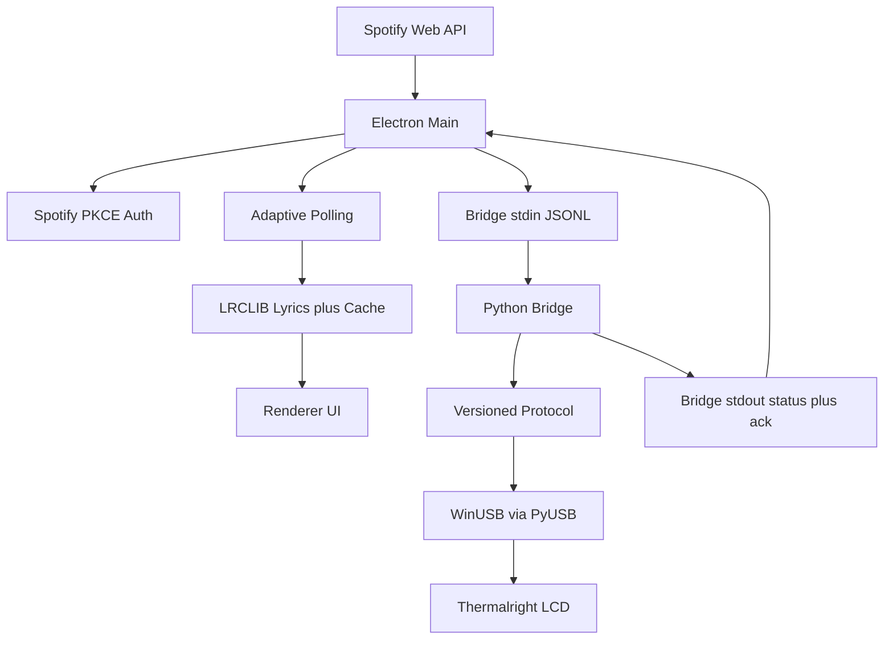

# Architecture

How LyricVision LCD moves Spotify state to the Thermalright glass.
Source of truth for scope: `odd/tasks/lyricvision-lcd.md`.
Hardware facts: `docs/project-context.md`.

## Overview

Two processes with one owner of USB. The Electron shell handles
everything user-facing (auth, polling, lyrics, cache, render, tray)
and sends frame state over stdin. The Python sidecar owns all USB
I/O (handshake, lookup, rotate, encode, bulk transfer) and reports
back over stdout. The UI never touches USB directly.

## Data flow



## ASCII fallback

```text
Spotify Web API --> Electron Main --> Bridge stdin (JSONL, seq)
  Electron Main: PKCE auth, adaptive polling, LRCLIB + cache, renderer UI
  Python Bridge: handshake, registry lookup, rotate, JPEG encode, bulk out
Bridge stdout (status ~1 Hz, ack per frame) --> Electron Main
Electron Main --> tray + lcdStatus
Python Bridge --> WinUSB/PyUSB --> Thermalright LCD
```

## Process split

| Concern | Owner | Notes |
|---|---|---|
| Spotify auth and polling | Electron shell | PKCE S256, tokens in safeStorage, 2-4 s active / 15 s idle |
| Lyrics fetch and cache | Electron shell | LRCLIB, disk LRU plus TTL |
| Frame composition | Electron shell | Portrait 480x854 unified layout (cover plus lyrics) |
| USB handshake and transfer | Python sidecar | PM/SUB identity, 16 KiB chunks, ZLP rule |
| Rotate and encode | Python sidecar | 90 deg CW into 854x480 buffer, JPEG q80 4:2:0 |
| Health and recovery | Both | Versioned seq plus ack, ~1 Hz status, heartbeat, auto-restart with backoff |

## Further reading

- Shell internals and manual GUI checks: [Shell notes](shell-notes.md)
- Sidecar wire contract: [Bridge README](../bridge/README.md)
- Build and installer pipeline: [Packaging](packaging.md)
- Panel registry and handshake bytes: [Project context](project-context.md)
